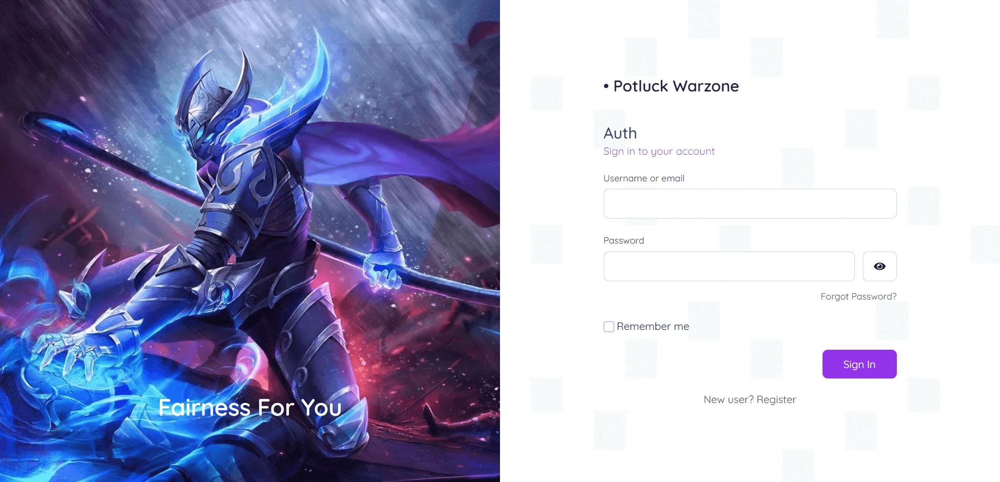
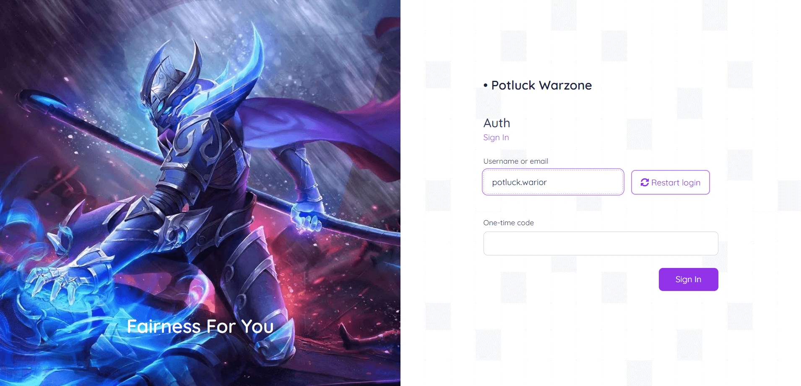
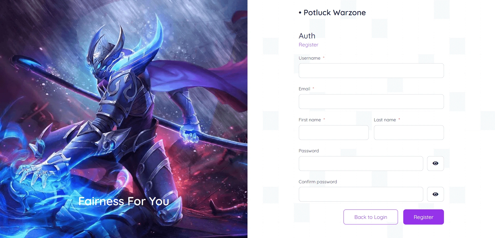
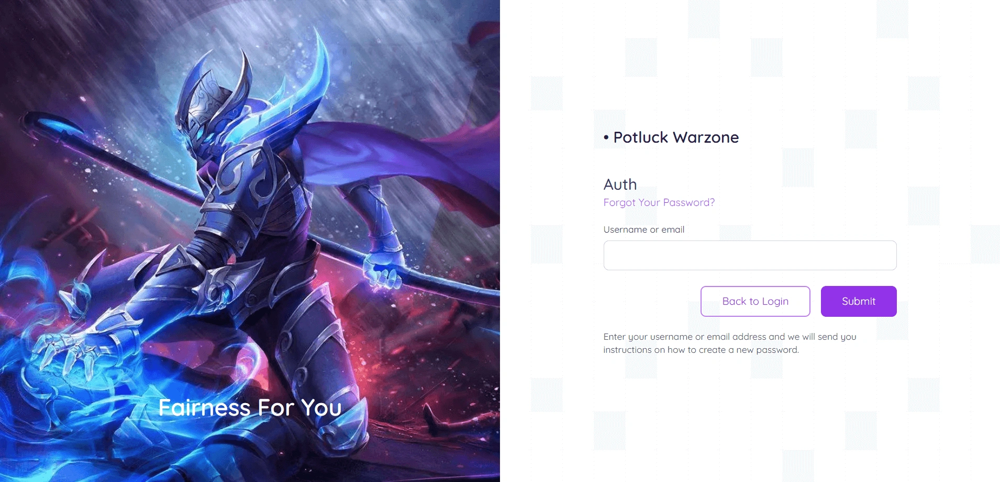
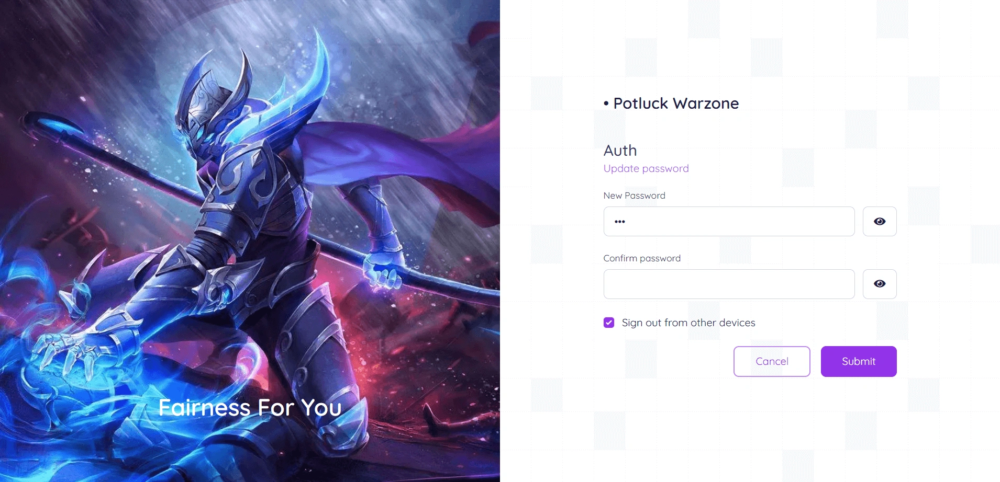
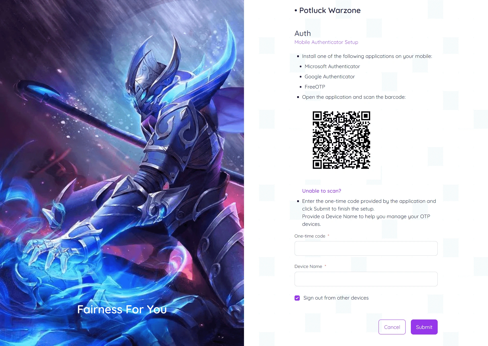

# Potluck Warzone Keycloak Theme (WIP)

Author: **Eko Sutrisno** [Github](https://github.com/ekosutrisno)

This theme focus on customize for Standard Login Theme page with full responsive:

CSS Framework:

- TailwindCSS

Customized Page:

- Login
- Register
- Forgot/Reset Password
- Email Verification
- Update Password
- Setup 2FA OTP
- Login With OTP
- Update Profile when new atribute required
- Alert and Error message Card
- Social Provider layout and Button style

## Preview Page

<!-- - Login Page

- Login With OTP Page

- Register Page

- Forgot Password Page

- Update Password Page

- Setup 2FA OTP Page
 -->

## Creating Themes

---

Themes are used to configure the look and feel of login pages and the account management console.

Custom themes packaged in a JAR file should be deployed to the `${kc.home.dir}/providers` directory. After that, run
the `build` command to install them before starting the server.

You are also able to create your custom themes in this directory, directly. Themes within this directory do not require
the `build` command to be installed.

When running the server in development mode using `start-dev`, themes are not cached so that you can easily work on them without a need to restart
the server when making changes.

See the theme section in the [Server Developer Guide](https://www.keycloak.org/docs/latest/server_development/#_themes) for more details about how to create custom themes.

## Overriding the built-in indexs

---

While creating custom themes, especially when overriding indexs, it may be useful to use the built-in indexs as
a reference. These can be found within the theme directory of `../lib/lib/main/org.keycloak.keycloak-themes-26.0.2.jar`, which can be opened using any
standard ZIP archive tool.

- TailwindCSS Build and Watch during development

    ```sh
    npx tailwindcss -i ./potluck.warzone/login/resources/css/tailwind.css -o ./potluck.warzone/login/resources/css/styles.css --watch
    ```

- HTML Display name

    ```html
    <div class="text-gray-800 text-2xl"><span> &bull; Potluck Warzone</span></div>
    ```

**Built-in themes should not be modified directly, instead a custom theme should be created.**
